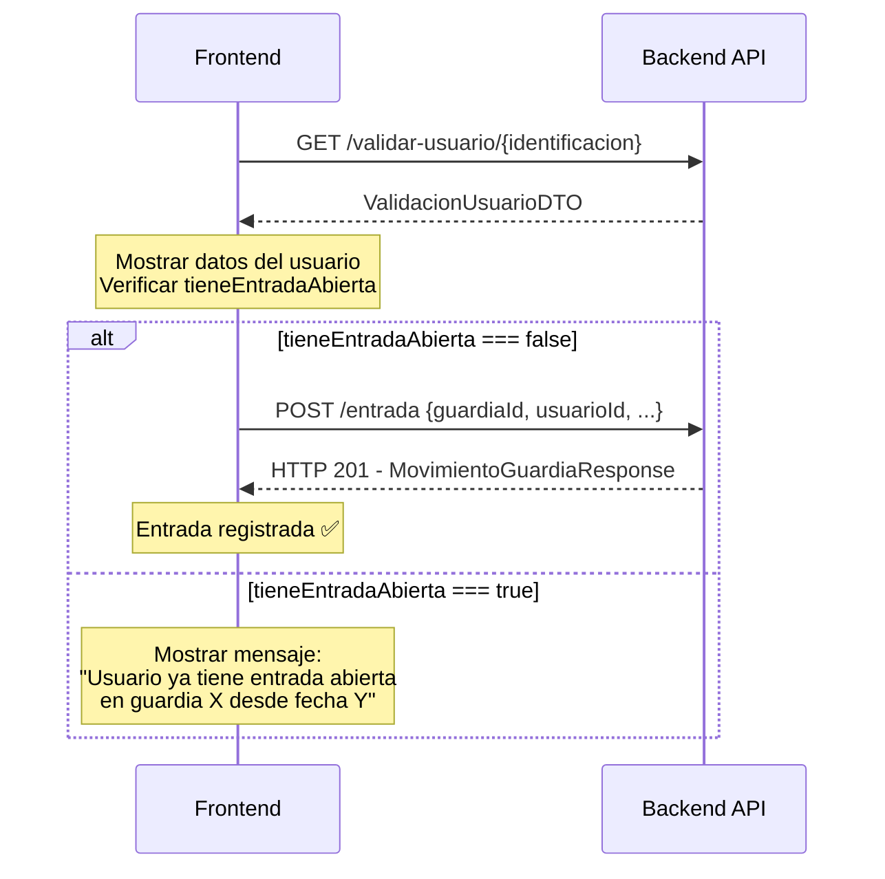
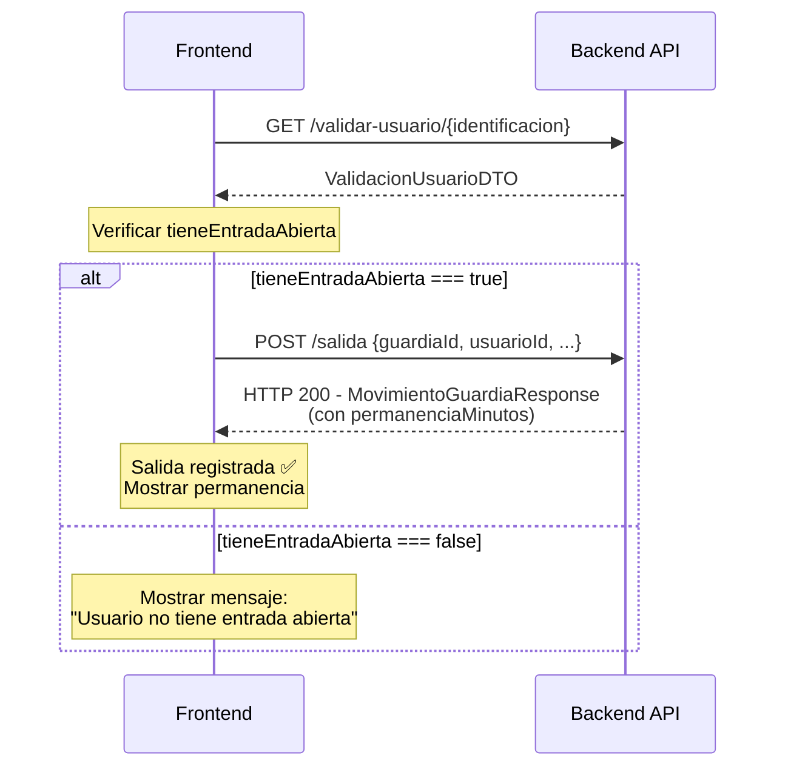

# API Movimientos de Guardia - Resumen de Endpoints

**Última actualización:** 2025-12-15  
**Base Path:** `/api/movimientos-guardia`  
**Controller:** `MovimientoGuardiaController`

---

## 📑 Índice

1. [Operaciones Principales (Registrar Entrada/Salida)](#operaciones-principales)
2. [Validaciones (Solo Lectura)](#validaciones)
3. [Consultas y Reportes](#consultas-y-reportes)
4. [DTOs de Request](#dtos-de-request)
5. [DTOs de Response](#dtos-de-response)
6. [Códigos de Error Comunes](#códigos-de-error-comunes)

---

## 🔐 Permisos Requeridos

| Permiso | Descripción |
|---------|-------------|
| `ITEM_CONTROL_DE_INGRESO_Y_SALIDA` | Registrar entradas/salidas y validar |
| `ITEM_VALIDAR_USUARIOS` | Solo validar usuarios (sin registrar movimientos) |
| `ITEM_VALIDAR_VEHICULOS` | Solo validar vehículos |
| `ITEM_VER_MOVIMIENTOS_GUARDIA` | Ver listados de movimientos |
| `ITEM_VER_ENTRADAS_ABIERTAS` | Ver todas las entradas abiertas del sistema |

---

## 1️⃣ Operaciones Principales

### 1.1 Registrar ENTRADA

Registra el ingreso de un usuario a una guardia.

**Endpoint:**
```
POST /api/movimientos-guardia/entrada
```

**Permisos:** `ITEM_CONTROL_DE_INGRESO_Y_SALIDA`

**Request Body:**
```json
{
  "guardiaId": "uuid",          // REQUERIDO: ID de la guardia o GuardiaUsuarioEntity
  "usuarioId": "uuid",          // REQUERIDO: UUID del usuario
  "vehiculoId": "uuid",         // OPCIONAL: UUID del vehículo (null si no lleva vehículo)
  "adminGuardiaId": "uuid",     // REQUERIDO: UUID del guardia que registra
  "observaciones": "string"     // OPCIONAL: Texto libre (null si no hay observaciones)
}
```

**Response (HTTP 201 Created):**
```json
{
  "id": "uuid",
  "organizacionId": "uuid",
  "seccionId": "uuid",
  "guardiaId": "uuid",
  "usuarioId": "uuid",
  "vehiculoId": "uuid",
  "adminGuardiaId": "uuid",
  "tipo": "ENTRADA",
  "timestampMovimiento": "2025-12-15T19:45:00Z",
  "observaciones": "string o null",
  "entradaAsociadaId": null,
  "permanenciaMinutos": null,
  "registroVehiculoIncluido": true/false,
  "guardiaNombre": "PUENTE TABLA",
  "usuarioNombre": "Juan Pérez",
  "vehiculoPlaca": "ABC-123",
  "adminGuardiaNombre": "Admin Guardia"
}
```

**Validaciones:**
- ✅ La guardia debe existir y estar activa
- ✅ La guardia debe permitir entradas (`permiteEntrada = true`)
- ✅ El usuario debe existir y estar activo
- ✅ El usuario debe tener permisos en esa guardia (asignado y no restringido)
- ❌ **El usuario NO puede tener otra entrada abierta (sin salida)**
- ✅ Si se especifica vehículo, debe existir y pertenecer al usuario

**Errores Comunes:**
```json
// HTTP 400 - Usuario ya tiene entrada abierta
{
  "message": "El usuario ya tiene una entrada abierta en la guardia 'PUENTE TABLA' desde 2025-12-15T19:45:00Z. Debe registrar la SALIDA antes de ingresar nuevamente."
}

// HTTP 400 - Guardia no permite entradas
{
  "message": "Esta guardia no permite registrar entradas"
}
```

---

### 1.2 Registrar SALIDA

Registra la salida de un usuario de una guardia. Calcula automáticamente la permanencia en minutos.

**Endpoint:**
```
POST /api/movimientos-guardia/salida
```

**Permisos:** `ITEM_CONTROL_DE_INGRESO_Y_SALIDA`

**Request Body:**
```json
{
  "guardiaId": "uuid",          // REQUERIDO: ID de la guardia o GuardiaUsuarioEntity
  "usuarioId": "uuid",          // REQUERIDO: UUID del usuario
  "vehiculoId": "uuid",         // OPCIONAL: UUID del vehículo (debe coincidir con la entrada)
  "adminGuardiaId": "uuid",     // REQUERIDO: UUID del guardia que registra
  "observaciones": "string"     // OPCIONAL: Texto libre (null si no hay observaciones)
}
```

**Response (HTTP 200 OK):**
```json
{
  "id": "uuid",
  "organizacionId": "uuid",
  "seccionId": "uuid",
  "guardiaId": "uuid",
  "usuarioId": "uuid",
  "vehiculoId": "uuid o null",
  "adminGuardiaId": "uuid",
  "tipo": "SALIDA",
  "timestampMovimiento": "2025-12-15T21:30:00Z",
  "observaciones": "string o null",
  "entradaAsociadaId": "uuid",       // ID de la entrada asociada
  "permanenciaMinutos": 105,         // Calculado automáticamente
  "registroVehiculoIncluido": true/false,
  "guardiaNombre": "PUENTE TABLA",
  "usuarioNombre": "Juan Pérez",
  "vehiculoPlaca": "ABC-123",
  "adminGuardiaNombre": "Admin Guardia"
}
```

**Validaciones:**
- ✅ La guardia debe existir y estar activa
- ✅ La guardia debe permitir salidas (`permiteSalida = true`)
- ✅ El usuario debe existir y estar activo
- ✅ **El usuario DEBE tener exactamente 1 entrada abierta (sin salida)**
- ❌ **El usuario NO puede registrar salida sin tener entrada abierta**
- ✅ Si se especifica vehículo, debe coincidir con el de la entrada

**Errores Comunes:**
```json
// HTTP 400 - No tiene entrada abierta
{
  "message": "El usuario no tiene ninguna entrada abierta. Debe registrar una ENTRADA antes de registrar la salida."
}

// HTTP 400 - Múltiples entradas abiertas (inconsistencia)
{
  "message": "El usuario tiene múltiples entradas abiertas (inconsistencia detectada). Contacte al administrador."
}

// HTTP 400 - Guardia no permite salidas
{
  "message": "Esta guardia no permite registrar salidas"
}
```

---

## 2️⃣ Validaciones (Solo Lectura)

### 2.1 Validar Usuario (por UUID o Identificación)

Valida un usuario y retorna su información completa **SIN registrar movimiento**. Acepta UUID o identificación.

**Endpoint:**
```
GET /api/movimientos-guardia/validar-usuario/{usuarioIdOIdentificacion}
```

**Permisos:** `ITEM_VALIDAR_USUARIOS` o `ITEM_CONTROL_DE_INGRESO_Y_SALIDA`

**Path Parameters:**
- `usuarioIdOIdentificacion` (string):
  - Si es formato UUID: busca por ID
  - Si NO es UUID: busca por identificación (cédula, pasaporte, etc.)

**Ejemplos:**
```
GET /api/movimientos-guardia/validar-usuario/3b8536c4-c5b6-4298-879e-338e925bbfdc
GET /api/movimientos-guardia/validar-usuario/1073995282
```

**Response (HTTP 200 OK):**
```json
{
  "id": "uuid",                           // UUID del usuario
  "existe": true,                         // Si el usuario fue encontrado
  "activo": true,                         // Si está activo
  "nombreCompleto": "Juan Pérez",
  "username": "jperez",
  "tipoIdentificacion": "CEDULA",         // CEDULA, PASAPORTE, etc.
  "identificacion": "1073995282",
  "seccion": "Sección Principal",
  "restricciones": [],                    // Array de restricciones activas
  "vehiculos": [                          // Array de vehículos del usuario
    {
      "id": "uuid",
      "placa": "ABC-123",
      "color": "Rojo",
      "marca": "Toyota",
      "modelo": "Corolla",
      "tipo": "AUTOMOVIL"
    }
  ],
  "tieneEntradaAbierta": true,           // Si tiene entrada sin salida
  "entradaAbierta": {                    // Información de la entrada (si existe)
    "id": "uuid",
    "guardiaNombre": "PUENTE TABLA",
    "guardiaId": "uuid",
    "fechaEntrada": "2025-12-15T19:45:00Z",
    "vehiculoPlaca": "ABC-123",
    "observaciones": "string o null"
  }
}
```

**Caso: Usuario no encontrado**
```json
{
  "existe": false,
  "activo": false,
  "nombreCompleto": null,
  "username": null,
  "tipoIdentificacion": null,
  "identificacion": null,
  "seccion": null,
  "restricciones": [],
  "vehiculos": [],
  "tieneEntradaAbierta": false,
  "entradaAbierta": null
}
```

---

### 2.2 Validar Usuario por Identificación (Específico)

Endpoint específico para validar por identificación (cédula, pasaporte, etc.).

**Endpoint:**
```
GET /api/movimientos-guardia/validar-usuario-identificacion/{identificacion}
```

**Permisos:** `ITEM_VALIDAR_USUARIOS` o `ITEM_CONTROL_DE_INGRESO_Y_SALIDA`

**Path Parameters:**
- `identificacion` (string): Cédula, pasaporte u otro documento

**Ejemplo:**
```
GET /api/movimientos-guardia/validar-usuario-identificacion/1073995282
```

**Response:** Igual que el endpoint anterior (2.1)

---

### 2.3 Validar Vehículo

Valida un vehículo y retorna su información **SIN registrar movimiento**.

**Endpoint:**
```
GET /api/movimientos-guardia/validar-vehiculo/{vehiculoId}
```

**Permisos:** `ITEM_VALIDAR_VEHICULOS` o `ITEM_CONTROL_DE_INGRESO_Y_SALIDA`

**Path Parameters:**
- `vehiculoId` (UUID): ID del vehículo

**Response (HTTP 200 OK):**
```json
{
  "existe": true,
  "estado": "ACTIVO",              // ACTIVO, INACTIVO, BLOQUEADO
  "placa": "ABC-123",
  "usuarioAsociado": "Juan Pérez", // Nombre del propietario
  "usuarioId": "uuid",
  "ultimaActividad": "2025-12-15T19:45:00Z"
}
```

**Caso: Vehículo no encontrado**
```json
{
  "existe": false,
  "estado": null,
  "placa": null,
  "usuarioAsociado": null,
  "usuarioId": null,
  "ultimaActividad": null
}
```

---

## 3️⃣ Consultas y Reportes

### 3.1 Buscar Entrada Abierta de Usuario

Busca si un usuario tiene entrada abierta (sin salida registrada).

**Endpoint:**
```
GET /api/movimientos-guardia/entrada-abierta/{usuarioId}
```

**Permisos:** `ITEM_CONTROL_DE_INGRESO_Y_SALIDA` o `ITEM_VER_MOVIMIENTOS_GUARDIA`

**Path Parameters:**
- `usuarioId` (UUID): ID del usuario

**Response (HTTP 200 OK):** MovimientoGuardiaResponse (ver sección 5.1)

**Response (HTTP 204 No Content):** Si no tiene entrada abierta

---

### 3.2 Contar Entradas Abiertas de Usuario

Cuenta cuántas entradas abiertas tiene un usuario (debería ser 0 o 1).

**Endpoint:**
```
GET /api/movimientos-guardia/entradas-abiertas/count/{usuarioId}
```

**Permisos:** `ITEM_CONTROL_DE_INGRESO_Y_SALIDA` o `ITEM_VER_MOVIMIENTOS_GUARDIA`

**Path Parameters:**
- `usuarioId` (UUID): ID del usuario

**Response (HTTP 200 OK):**
```json
{
  "count": 1
}
```

---

### 3.3 Listar Movimientos de Usuario

Lista todos los movimientos (entradas y salidas) de un usuario.

**Endpoint:**
```
GET /api/movimientos-guardia/usuario/{usuarioId}
```

**Permisos:** `ITEM_VER_MOVIMIENTOS_GUARDIA`

**Path Parameters:**
- `usuarioId` (UUID): ID del usuario

**Response (HTTP 200 OK):**
```json
[
  {
    "id": "uuid",
    "tipo": "ENTRADA",
    "timestampMovimiento": "2025-12-15T19:45:00Z",
    ...
  },
  {
    "id": "uuid",
    "tipo": "SALIDA",
    "timestampMovimiento": "2025-12-15T21:30:00Z",
    "permanenciaMinutos": 105,
    ...
  }
]
```

---

### 3.4 Listar Movimientos de Guardia

Lista todos los movimientos registrados en una guardia específica.

**Endpoint:**
```
GET /api/movimientos-guardia/guardia/{guardiaId}
```

**Permisos:** `ITEM_VER_MOVIMIENTOS_GUARDIA`

**Path Parameters:**
- `guardiaId` (UUID): ID de la guardia

**Response (HTTP 200 OK):** Array de MovimientoGuardiaResponse

---

### 3.5 Listar Movimientos de Sección

Lista todos los movimientos de todas las guardias de una sección.

**Endpoint:**
```
GET /api/movimientos-guardia/seccion/{seccionId}
```

**Permisos:** `ITEM_VER_MOVIMIENTOS_GUARDIA`

**Path Parameters:**
- `seccionId` (UUID): ID de la sección

**Response (HTTP 200 OK):** Array de MovimientoGuardiaResponse

---

### 3.6 Detectar Todas las Entradas Abiertas

Lista TODAS las entradas abiertas del sistema (útil para detectar inconsistencias).

**Endpoint:**
```
GET /api/movimientos-guardia/entradas-abiertas
```

**Permisos:** `ITEM_VER_ENTRADAS_ABIERTAS`

**Response (HTTP 200 OK):** Array de MovimientoGuardiaResponse con tipo "ENTRADA" sin salida

---

### 3.7 Movimientos por Rango de Fechas

Lista movimientos de una guardia en un rango de fechas específico.

**Endpoint:**
```
GET /api/movimientos-guardia/guardia/{guardiaId}/fechas?desde={iso8601}&hasta={iso8601}
```

**Permisos:** `ITEM_VER_MOVIMIENTOS_GUARDIA`

**Path Parameters:**
- `guardiaId` (UUID): ID de la guardia

**Query Parameters:**
- `desde` (Instant/ISO8601): Fecha inicial
- `hasta` (Instant/ISO8601): Fecha final

**Ejemplo:**
```
GET /api/movimientos-guardia/guardia/aab86ae0-7d9c-46dd-b615-d65a0a5577c7/fechas?desde=2025-12-15T00:00:00Z&hasta=2025-12-15T23:59:59Z
```

**Response (HTTP 200 OK):** Array de MovimientoGuardiaResponse

---

### 3.8 Obtener Movimiento por ID

Obtiene un movimiento específico por su ID.

**Endpoint:**
```
GET /api/movimientos-guardia/{movimientoId}
```

**Permisos:** `ITEM_VER_MOVIMIENTOS_GUARDIA`

**Path Parameters:**
- `movimientoId` (UUID): ID del movimiento

**Response (HTTP 200 OK):** MovimientoGuardiaResponse

**Response (HTTP 404 Not Found):** Si el movimiento no existe

---

## 4️⃣ DTOs de Request

### 4.1 RegistrarEntradaRequest

```typescript
{
  guardiaId: UUID;        // REQUERIDO - ID de GuardiaEntity o GuardiaUsuarioEntity
  usuarioId: UUID;        // REQUERIDO - UUID del usuario
  vehiculoId?: UUID;      // OPCIONAL - null si no lleva vehículo
  adminGuardiaId: UUID;   // REQUERIDO - UUID del guardia que registra
  observaciones?: string; // OPCIONAL - null si no hay observaciones
}
```

**Validaciones:**
- `guardiaId`: NotNull
- `usuarioId`: NotNull
- `adminGuardiaId`: NotNull
- `vehiculoId`: Opcional (puede ser null)
- `observaciones`: Opcional (puede ser null)

---

### 4.2 RegistrarSalidaRequest

```typescript
{
  guardiaId: UUID;        // REQUERIDO - ID de GuardiaEntity o GuardiaUsuarioEntity
  usuarioId: UUID;        // REQUERIDO - UUID del usuario
  vehiculoId?: UUID;      // OPCIONAL - null si no llevó vehículo en la entrada
  adminGuardiaId: UUID;   // REQUERIDO - UUID del guardia que registra
  observaciones?: string; // OPCIONAL - null si no hay observaciones
}
```

**Validaciones:**
- `guardiaId`: NotNull
- `usuarioId`: NotNull
- `adminGuardiaId`: NotNull
- `vehiculoId`: Opcional (puede ser null)
- `observaciones`: Opcional (puede ser null)

**Nota:** `vehiculoId` debe coincidir con el registrado en la entrada (si aplica)

---

## 5️⃣ DTOs de Response

### 5.1 MovimientoGuardiaResponse

```typescript
{
  id: UUID;
  organizacionId: UUID;
  seccionId: UUID;
  guardiaId: UUID;
  usuarioId: UUID;
  vehiculoId: UUID | null;
  adminGuardiaId: UUID;
  tipo: "ENTRADA" | "SALIDA";
  timestampMovimiento: string;        // ISO8601
  observaciones: string | null;
  entradaAsociadaId: UUID | null;     // Solo para SALIDA
  permanenciaMinutos: number | null;  // Solo para SALIDA
  registroVehiculoIncluido: boolean;
  
  // Datos anidados (nombres para display)
  guardiaNombre: string;
  usuarioNombre: string;
  vehiculoPlaca: string | null;
  adminGuardiaNombre: string;
}
```

---

### 5.2 ValidacionUsuarioDTO

```typescript
{
  id: UUID;                    // UUID del usuario
  existe: boolean;             // Si el usuario fue encontrado
  activo: boolean;             // Si está activo
  nombreCompleto: string;
  username: string;
  tipoIdentificacion: string;  // "CEDULA", "PASAPORTE", etc.
  identificacion: string;
  seccion: string;
  restricciones: string[];
  vehiculos: VehiculoInfoDTO[];
  tieneEntradaAbierta: boolean;
  entradaAbierta: EntradaAbiertaDTO | null;
}
```

---

### 5.3 EntradaAbiertaDTO

```typescript
{
  id: UUID;
  guardiaNombre: string;
  guardiaId: UUID;
  fechaEntrada: string;        // ISO8601
  vehiculoPlaca: string | null;
  observaciones: string | null;
}
```

---

### 5.4 VehiculoInfoDTO

```typescript
{
  id: UUID;
  placa: string;
  color: string;
  marca: string;
  modelo: string;
  tipo: string;  // "AUTOMOVIL", "MOTOCICLETA", etc.
}
```

---

### 5.5 ValidacionVehiculoDTO

```typescript
{
  existe: boolean;
  estado: string;              // "ACTIVO", "INACTIVO", "BLOQUEADO"
  placa: string;
  usuarioAsociado: string;
  usuarioId: UUID;
  ultimaActividad: string;
}
```

---

### 5.6 CountResponse

```typescript
{
  count: number;
}
```

---

## 6️⃣ Códigos de Error Comunes

### HTTP 400 - Bad Request

**Entrada Bloqueada (ya tiene entrada abierta):**
```json
{
  "message": "El usuario ya tiene una entrada abierta en la guardia 'PUENTE TABLA' desde 2025-12-15T19:45:00Z. Debe registrar la SALIDA antes de ingresar nuevamente.",
  "timestamp": "2025-12-15T20:30:00Z"
}
```

**Salida Bloqueada (no tiene entrada abierta):**
```json
{
  "message": "El usuario no tiene ninguna entrada abierta. Debe registrar una ENTRADA antes de registrar la salida.",
  "timestamp": "2025-12-15T20:30:00Z"
}
```

**Inconsistencia (múltiples entradas abiertas):**
```json
{
  "message": "El usuario tiene múltiples entradas abiertas (inconsistencia detectada). Contacte al administrador.",
  "timestamp": "2025-12-15T20:30:00Z"
}
```

**Guardia no permite entradas/salidas:**
```json
{
  "message": "Esta guardia no permite registrar entradas",
  "timestamp": "2025-12-15T20:30:00Z"
}
```

**Usuario no activo:**
```json
{
  "message": "El usuario no está activo — acceso denegado",
  "timestamp": "2025-12-15T20:30:00Z"
}
```

**Guardia no asignada:**
```json
{
  "message": "Guardia no asignada al usuario — operación bloqueada",
  "timestamp": "2025-12-15T20:30:00Z"
}
```

---

### HTTP 404 - Not Found

**Usuario no encontrado:**
```json
{
  "message": "Usuario no encontrado",
  "timestamp": "2025-12-15T20:30:00Z"
}
```

**Guardia no encontrada:**
```json
{
  "message": "Guardia no encontrada",
  "timestamp": "2025-12-15T20:30:00Z"
}
```

**Vehículo no encontrado:**
```json
{
  "message": "Vehículo no encontrado",
  "timestamp": "2025-12-15T20:30:00Z"
}
```

**Movimiento no encontrado:**
```json
{
  "message": "Movimiento no encontrado",
  "timestamp": "2025-12-15T20:30:00Z"
}
```

---

### HTTP 403 - Forbidden

**Sin permisos:**
```json
{
  "message": "Access Denied",
  "timestamp": "2025-12-15T20:30:00Z"
}
```

---

## 📊 Flujos Completos

### Flujo 1: Registrar Entrada con Validación Previa



---

### Flujo 2: Registrar Salida con Cálculo de Permanencia



---

## 🔑 Notas Importantes

### Sobre `guardiaId`

El campo `guardiaId` puede ser:
1. **ID de `GuardiaEntity`** (UUID de la guardia directamente)
2. **ID de `GuardiaUsuarioEntity`** (UUID de la relación usuario-guardia)

El backend **resuelve automáticamente** qué tipo de ID es mediante el método `resolverGuardiaId()`.

### Sobre Campos Opcionales

Los campos `vehiculoId` y `observaciones` son **opcionales**:
- Deben estar presentes en el JSON pero pueden ser `null`
- No usar `undefined`, usar `null` explícitamente

**✅ Correcto:**
```json
{
  "guardiaId": "uuid",
  "usuarioId": "uuid",
  "vehiculoId": null,
  "adminGuardiaId": "uuid",
  "observaciones": null
}
```

**❌ Incorrecto:**
```json
{
  "guardiaId": "uuid",
  "usuarioId": "uuid",
  "adminGuardiaId": "uuid"
  // vehiculoId y observaciones omitidos
}
```

### Sobre Validación de Entrada/Salida

**REGLA CRÍTICA:** Un usuario solo puede tener **UNA entrada abierta** a la vez.

- ❌ No puede registrar ENTRADA si ya tiene una entrada sin salida
- ❌ No puede registrar SALIDA si no tiene entrada abierta
- ✅ Flujo correcto: ENTRADA → SALIDA → ENTRADA → SALIDA...

### Sobre Logs en Consola

Al registrar movimientos, el backend muestra logs detallados:

```log
========== REGISTRAR ENTRADA - DATOS RECIBIDOS DEL FRONTEND ==========
guardiaId: xxx
usuarioId: yyy
...
🔍 Verificando entradas abiertas para usuario yyy
📊 Entradas abiertas encontradas: 0
✅ Usuario puede registrar entrada
```

Esto facilita el debugging durante el desarrollo.

---

## 📞 Soporte

Para más información sobre:
- **Configuración de guardias:** Ver `GuardiaController`
- **Asignación de usuarios a guardias:** Ver `GuardiaUsuarioController`
- **Validaciones detalladas:** Ver `MovimientoGuardiaServiceImpl`

---

**Fin del documento**

